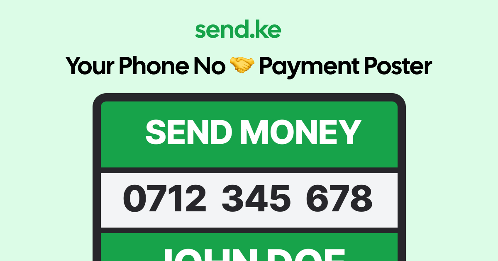

# m-poster

<p align="center">
  
</p>

## Make Mobile Payment Posters in Seconds, pay using Qr code included

**M-Poster** is an offline-capable web tool that lets you create beautiful payment posters for all M-Pesa transactions. The posters come with a Qr Code that a user can simply scan, enter the amount and make payents using the M-Pesa App. Perfect for businesses, street vendors, freelancers, and anyone who needs to receive mobile payments.

## 🔗 [Visit m-poster](https://m-poster-lovat.vercel.app/)

## ✨ Features

- **100% Free** - No hidden costs, no premium features
- **Works Offline** - Create posters even without an internet connection
- **No Account Required** - Just enter your details and download
- **Instant Downloads** - Get your poster in seconds
- **High-Quality Images** - Professional-looking posters every time
- **Mobile Friendly** - Works on all devices

## 📱 What is a Payment Poster?

A payment poster is a simple, effective way to display your mobile money details, it comes with a Qr Code that a user can simply scan using the M-Pesa App to expedite the payment process. Instead of complicated M-Pesa payment process, customers just:

1. See your payment details (Pybill, Till Number, etc)
2. Scan Qr code attached and initiate payment or..
3. Send money directly to it
4. That's it!

Perfect for places where mobile money is popular but QR codes are not widely used.

## 🚀 How to Use

1. Enter your Payment details (Paybill, Till Number etc)
2. Enter your name
3. Click "GET YOUR MONEY POSTER"
4. Share the downloaded image:
   - Print it for your shop/stall
   - Share it on social media
   - Add it to your invoices
   - Send it via WhatsApp or other messaging apps

## 💻 Development

### Prerequisites

- Node.js 18+
- npm or yarn

### Installation

```bash
# Clone the repository
git clone https://github.com/omondisteven/M-Poster.git
cd sendke

# Install dependencies
npm install
# or
yarn

# Start development server
npm run dev
# or
yarn dev
```

### Building for Production

```bash
npm run build
# or
yarn build
```

## 🌍 Contributing New Business Templates

We welcome contributions of new business templates for different types of small businesses in Kenya and beyond! Help make m-poster more useful for everyone.

### How to Add a New Template

1. Fork the repository
2. Edit the `src/data/templates.json` file to add your new business type
3. Follow this format for each new entry:

```json
{
  "name": "Business Name", // Display name (e.g., "Mitumba Seller")
  "slug": "business-slug", // URL-friendly identifier (e.g., "mitumba-seller")
  "description": "Short description of the business type",
  "size": {
    "width": 1200, // Recommended width in pixels
    "height": 675, // Recommended height in pixels
    "label": "Standard Format" // Format label (typically "Standard Format" or "Other Format")
  }
}
```

4. Submit a pull request with your changes
5. In your PR description, include:
   - Why this business type would benefit from m-poster
   - Any specific sizing considerations for this business

We especially welcome templates for small, one-person businesses in the informal sector!

## 🛠️ Technologies Used

- React
- TypeScript
- Vite
- Tailwind CSS
- html2canvas

## 📄 License

This project is open source and available under the [MIT License](LICENSE).

## 👨‍💻 Author

**Steve Omondi**

- GitHub: [@Omondisteven](https://github.com/Omondisteven)

---

<p align="center">
  Made with ❤️ in Kenya
</p>
